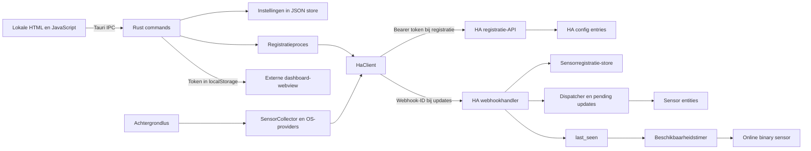

# Grondige projectaudit — Home Assistant Companion

Datum: **23 september 2026**. Status: **onderzoek afgerond; herstelwerk nog niet uitgevoerd**.

Dit document is de onderbouwde invoer voor een volgende specificatie. Het is geen goedgekeurde spec, uitvoeringsplan of verklaring dat de applicatie productierijp is. De bevindingen gelden voor de hieronder vastgelegde bronversies; de daadwerkelijke HA-versie en hardware van gebruikers zijn niet vastgesteld.

## 1. Hoofdconclusie

De opzet is bruikbaar: een relatief kleine desktopapp, een eigen HA-integratie, sensoren via webhooks en native traybediening. De belangrijkste problemen zitten echter in de grenzen tussen die onderdelen. Succesvolle HTTP-verzoeken worden gelijkgesteld aan verwerkte data, registratie bestaat in meerdere losse toestanden, beschikbaarheid heeft verschillende waarheden, en de tests controleren vooral losse hulpfuncties. Hierdoor kan de interface correct lijken terwijl metingen niet aankomen of verouderde waarden als actueel worden getoond.

Voor een volgende publieke release adviseer ik eerst de beveiligings- en betrouwbaarheidsproblemen op te lossen. Vooral de onbegrensde tokeninjectie in de dashboard-webview, uitgeschakelde TLS-certificaatcontrole, het meeleveren/installeren van WinRing0 en het herkennen van webhookbevestigingen verdienen voorrang. De audit bevat daarnaast concrete fouten in instellingen, installatie, release-signing, sensorsemantiek, beschikbaarheid, platformondersteuning en onderhoudbaarheid.

De bestaande tests zijn niet waardeloos: **13 uitgevoerde Rust-tests en 9 Python-tests slagen**. Ze rechtvaardigen alleen geen uitspraak dat de volledige keten werkt. Eén Rust-hardwaretest is bewust niet uitgevoerd omdat de geteste functie zelf een kernel-driver kan proberen te installeren/starten. Aanvullende offline reproducties bevestigen fouten die de bestaande tests niet ontdekken.

## 2. Afbakening, bronversies en bewijs

| Onderdeel | Onderzochte basis |
|---|---|
| Hoofdrepo | `659a6b8485a733a1043ac60a43144ae3a2d81cec` |
| Desktopversie | `1.0.4` in package.json, Cargo.toml en tauri.conf.json |
| Afzonderlijke lokale integratierepo | `ha-integration`, commit `d80f1f328a2ec099a27c13420736d4b944caf7e1` |
| Integratieversie | `1.0.10` in manifest.json |
| Inventaris | 58 tracked bestanden hoofdrepo + 24 tracked bestanden integratie = 82 |
| Uitvoeromgeving | Windows; Rust/Cargo 1.93.0; Node 23.4.0; npm 10.9.2; Python 3.12.10 |
| Externe referentie | Onder meer HA Core **2026.9.0**, Tauri-bundler **2.10.0** en lokaal gebruikte Tauri **2.10.2** |

De hoofdrepo was schoon bij aanvang. In de integratierepo bestonden al niet-getrackte `__pycache__`-mappen. Deze zijn niet verwijderd. Applicatiebroncode, configuratie en lockfiles zijn ongewijzigd gelaten. Corepack voegde tijdens een controle automatisch `packageManager` toe; uitsluitend die eigen wijziging is teruggedraaid. De webbuild is opnieuw gegenereerd in de genegeerde `dist`-map. Het auditgereedschap cargo-audit is geïnstalleerd onder de genegeerde `src-tauri/target/audit-tools`-map.

Bij de eindcontrole bleek `ha-integration/.gitignore` tijdens het onderzoek gewijzigd om `__pycache__` uit te sluiten. Deze wijziging is niet door de audit aangebracht en is behouden; de overige geïnventariseerde bronbestanden zijn met hashes ongewijzigd bevonden.

**Onderzocht:** alle eigen Rust-modules, frontend-JavaScript, HTML/CSS, integratie-Python, vertalingen, manifesten, buildscript, installer-hooks, releaseworkflow, dependencies/lockfiles, README's en de drie bestaande faseplannen. Generated schemas zijn gericht gecontroleerd; het geminificeerde externe particles-bundle op herkomst/header en opname in de build. Binaire afbeeldingen zijn geïnventariseerd, niet visueel beoordeeld. De driver is op bestandsmetadata, hash en handtekening onderzocht, niet gedecompileerd.

**Niet uitgevoerd:** echte HA-registratie, besturing van een gebruikersinstallatie, kernel-driverinstallatie, installer/uninstaller, OS-shutdown, platformbuilds op macOS/Linux, releasepublicatie, hardwarebenchmark, schermlezer- of visuele browsertest. Er is geen testdekkingpercentage gemeten. Er is geen claim dat alle mogelijke fouten hiermee zijn uitgesloten.

Bijlagen:

- [Inventaris met SHA-256 per bronbestand](evidence/inventory.csv).
- [Offline integratiereproducties](evidence/reproduce_integration.py) en [uitkomsten](evidence/integration-results.json).
- [Offline frontendreproducties](evidence/reproduce_frontend.cjs) en [uitkomsten](evidence/frontend-results.json).
- [Volledige Cargo/RustSec-scan](evidence/cargo-audit.json) en [Yarn-scan](evidence/yarn-audit.jsonl).
- [Controlelog en reproduceercommando's](VERIFICATIE.md).
- [Machineleesbaar bevindingenregister voor de latere spec](findings.json).

De offline reproducties voeren echte projectfuncties uit met minimale vervangers voor DOM, IPC en HA-infrastructuur. Ze bevestigen de betrokken logica, maar zijn geen volledige webview- of HA-integratietest. De scripts slagen wanneer het huidige defect aantoonbaar is; ze mogen dus niet als toekomstige acceptatietests worden overgenomen zonder de verwachte uitkomst om te draaien.

**Leeswijzer bronverwijzingen:** regelnummers horen bij de vastgelegde bronversies. Verkorte `src-tauri/...`- en `src/...`-paden beginnen onder `desktop-app/`; losse Rust-bestandsnamen beginnen onder `desktop-app/src-tauri/src/` (sensorproviders onder `sensors/`), losse frontendbestanden onder `desktop-app/src/` en losse integratie-Pythonbestanden onder `ha-integration/custom_components/desktop_app/`. De inventaris bevat de volledige paden.

## 3. Prioriteiten en bewijskracht

| Prioriteit | Betekenis |
|---|---|
| P0 | Direct aanpakken; groot risico op blootstelling van een HA-toegangstoken |
| P1 | Voor een betrouwbare volgende release oplossen of expliciet met bewijs afhandelen |
| P2 | Gepland verbeteren; aantoonbaar tekort of relevant risico |
| P3 | Kleinere afwerking of onderhoudsverbetering |

**R** = gereproduceerd met een uitgevoerde controle; **C** = bevestigd uit projectcode, zo nodig gecontroleerd tegen frameworkbroncode; **O** = verbeterkans of risico waarvoor de daadwerkelijke impact nog gemeten/getest moet worden. Een broncodebevinding kan betrouwbaar zijn zonder dat het schadelijke scenario op een echte installatie is uitgevoerd. Advisory-aantallen zijn geen aantallen bewezen exploiteerbare gaten in deze applicatie.

**54 bevindingen:** 1 P0, 24 P1, 27 P2, 2 P3. De verdeling is prioriteit voor herstel, geen statistische kwaliteitsmeting.

| ID | Prioriteit | Bevinding | Bewijs |
|---|---|---|---|
| SEC-01 | P0 | Dashboardscript injecteert het HA-token ook op vreemde origins | R/C |
| SEC-02 | P1 | TLS-certificaten worden onvoorwaardelijk vertrouwd | C |
| SEC-03 | P1 | Een bekende kwetsbare kernel-driver wordt meegeleverd en gestart | C |
| SEC-04 | P1 | De uninstaller verwijdert mogelijk een driver van andere software | C |
| SEC-05 | P1 | Runtime-driverinstallatie vertrouwt een gebruikersschrijfbaar bestand op grootte | C |
| SEC-06 | P1 | Webhookgeheimen komen in normale logs terecht | C |
| SEC-07 | P2 | Langdurig token staat in platte configuratie en brede settings-responses | C |
| SEC-08 | P2 | Lokale webview heeft geen CSP | C/O |
| SEC-09 | P2 | Ontwikkelserver serveert de hele desktopmap op alle interfaces | C |
| SEC-10 | P2 | Registratie controleert authenticatie, maar geen apparaateigenaarschap | C/O |
| REL-01 | P1 | HTTP 200 wordt ten onrechte als webhookbevestiging gezien | C |
| REL-02 | P1 | Tijdelijke webhookfout wist een mogelijk geldige registratie | C |
| REL-03 | P1 | URL/token wijzigen stopt sensorupdates zonder automatisch herstel | C |
| REL-04 | P1 | Registratiestatus kan gedeeltelijk opgeslagen en intern inconsistent zijn | C |
| REL-05 | P1 | Afsluittimeout begrenst niet het wachten op de HTTP-lock | C |
| REL-06 | P1 | Windows-hook kiest geen eigen HWND en verwerkt annulering niet | C |
| REL-07 | P1 | Autostartschakelaar heeft geen effect op OS-autostart | C |
| REL-08 | P2 | Opslaan meldt succes vóór duurzame opslag en zonder schrijffout | C |
| HA-01 | P1 | Beschikbaarheid heeft uiteenlopende toestanden en kan fout blijven staan | R |
| HA-02 | P1 | Instelbaar update-interval wordt niet naar HA gestuurd; heartbeat hangt van sensoren af | C/R |
| HA-03 | P1 | Webhookpayloads worden onvoldoende gevalideerd en fouten tellen als activiteit | R/C |
| HA-04 | P1 | Gewone sensorwaarden blijven beschikbaar terwijl het apparaat offline is | C |
| HA-05 | P2 | Verwijdering/unload ruimt eigen stores en timer niet consequent op | C |
| HA-06 | P2 | Reparatie van een webhook controleert niet of het apparaat geladen/actief is | C |
| HA-07 | P2 | Bestaande apparaatmetadata veroudert na een app-/OS-update | C |
| SEN-01 | P1 | 'CPU Temperature' heeft geen betrouwbaar vastgelegde meetbetekenis | C |
| SEN-02 | P2 | Geheugen- en VRAM-eenheden zijn verkeerd benoemd | C |
| SEN-03 | P2 | Sensor-ID's veranderen bij andere hardwareaantallen of naamvolgorde | C |
| SEN-04 | P2 | In-/uitschakelen en verdwijnen van sensoren heeft geen volledig lifecyclecontract | C |
| SEN-05 | P2 | Ondersteunde metingen verschillen sterk per platform en vendor | C |
| SEN-06 | P2 | Uptime en Last Boot verliezen HA-typefunctionaliteit door presentatie in de meetwaarde | C/O |
| PERF-01 | P2 | Iedere tien cycli worden alle sensoren opnieuw geregistreerd en stores herschreven | C/O |
| PERF-02 | P2 | Collectie doet onnodig werk en blokkerende OS-calls op async workers | C/O |
| OBS-01 | P2 | Logs groeien onbeperkt en release-diagnostiek is niet platformgelijk | C |
| ARCH-01 | P2 | Protocol, sensordefinities en toestand zijn op meerdere plaatsen handmatig gekoppeld | C/O |
| UI-01 | P2 | Escape/annuleren kan buiten de modal een dashboard openen of opnieuw laden | R/C |
| UI-02 | P2 | Registratie kan eindigen met een verborgen fout; dubbele submits zijn mogelijk | R/C |
| UI-03 | P2 | Instellingen missen afdwingbare invoervalidatie | R/C |
| UI-04 | P2 | Annuleren draait sensorwijzigingen niet terug; herstelsetup reset voorkeuren | C |
| UI-05 | P3 | Vertaling en taalwissel zijn onvolledig | R/C |
| UI-06 | P2 | Modaltoegankelijkheid en kleine schermhoogte zijn onvoldoende afgedekt | C/O |
| UI-07 | P3 | Achtergrondanimatie heeft geen koppeling aan de zichtbare appmodus | C/O |
| DEP-01 | P1 | Cargo.lock bevat bekende kwetsbaarheidsmatches en onderhoudsschuld | R |
| DEP-02 | P2 | Yarn-tree bevat acht advisories; npm-scan geeft een onvolledig geruststellend beeld | R |
| BUILD-01 | P1 | Clean npm-installatie faalt; dependency-resolutie is niet eenduidig | R/C |
| BUILD-02 | P1 | Windows-signingconfiguratie faalt zodra een certificaat wordt gebruikt | R |
| BUILD-03 | P1 | Driverinstallatie gebruikt onjuist resourcepad en heeft geen gelijkwaardige MSI-route | C |
| BUILD-04 | P1 | Releases hebben geen tests, lint, security- of contractgates | C/R |
| BUILD-05 | P2 | Een release bindt desktop, native versie en integratiecommit niet vast samen | C |
| BUILD-06 | P2 | Geclaimde cross-platform ondersteuning heeft geen bewezen testmatrix | C/O |
| BUILD-07 | P1 | De opgegeven minimale HA-versie past niet bij de geïmporteerde API | C |
| TEST-01 | P1 | De bestaande suite test de kritieke integratiepaden niet | C/R |
| DOC-01 | P2 | README's en eerdere plannen beschrijven onderling verschillende producten | C |
| DOC-02 | P2 | Vendorcomponenten missen volledige distributie-/herkomstregistratie | C/O |

## 4. Architectuur en gegevensstroom

Positieve onderdelen om te behouden: één herbruikbare HTTP-client, aanvraagtimeout, willekeurige device-ID's en sterke willekeurige webhook-ID's, authenticated registratie, POST-only webhooks, gebundelde JavaScript-assets, scheiding tussen hardwareproviders en HA-payloads, pending updates voor entity-startupraces en beperkte retry bij initiële registratie. De custom HA-store bevat sensormetadata terwijl config entries de apparaten registreren; dat is een bruikbare scheiding mits lifecycle en opschoning correct worden uitgewerkt.

## 5. Beveiliging en privacy

### SEC-01 — P0 — Dashboardscript injecteert het HA-token ook op vreemde origins [R/C]

**Bewijs:** `desktop-app/src-tauri/src/commands.rs:305–348`, vooral `open_dashboard_view` en `.initialization_script()`. Het script schrijft `hassTokens` zonder `location.origin`-controle. Er is ook geen navigatiebeperking. Tauri beschrijft dat initialisatiescripts opnieuw draaien bij documentnavigaties; op Windows ook in subframes. Zie [Tauri WebviewBuilder-broncode, versie 2.10.2](https://docs.rs/crate/tauri/2.10.2/source/src/webview/mod.rs).

**Scenario/impact:** een link, redirect of ingesloten frame naar een ander domein kan het script in die origin uitvoeren. Daarmee komt het langdurige HA-token in diens localStorage terecht, leesbaar voor scripts van dat domein. De auditprobe voert het werkelijke script met een synthetisch token op een afwijkende origin uit en bevestigt de write. Een native-webviewtest van navigaties/frames resteert.

**Spec-invoer:** valideer en vergelijk exact scheme/host/port van de vertrouwde HA-origin, beperk navigaties, open externe links buiten de vertrouwde webview en ontwerp tokenopslag/afmelding expliciet. Gebruik JSON-serialisatie voor scriptwaarden.

**Acceptatie:** geen tokenwrite bij een vreemde top-level origin, redirect, subframe, `about:blank` of foutpagina; de normale HA-login blijft werken. Test met synthetische tokens.

### SEC-02 — P1 — TLS-certificaten worden onvoorwaardelijk vertrouwd [C]

**Bewijs:** `desktop-app/src-tauri/src/ha_client.rs:69–75`: `.danger_accept_invalid_certs(true)` geldt voor elke server. Registratie verstuurt vervolgens een Bearer token. Dit is geen instelling voor één expliciet vertrouwd lokaal certificaat.

**Impact:** een actieve onderschepper kan zich als HA voordoen zonder geldig certificaat; token en gegevens lopen gevaar. Rust-client en dashboard-webview hebben bovendien verschillende TLS-paden, zodat API-verkeer kan werken terwijl het dashboard een certificaatfout toont.

**Spec-invoer:** normale certificaatvalidatie als standaard; een expliciete en beperkte oplossing voor eigen CA's indien dat een productvereiste is. Leg ook het beleid voor HTTP op een LAN vast.

**Acceptatie:** geldig certificaat werkt; verlopen, verkeerd-hostnaam- en onbekend-CA-certificaat falen; een expliciet vertrouwde eigen CA werkt volgens hetzelfde beleid. Geen globale TLS-bypass.

### SEC-03 — P1 — Een bekende kwetsbare kernel-driver wordt meegeleverd en gestart [C]

**Bewijs:** `src-tauri/src/sensors/winring0.rs:37–93`, `src-tauri/tauri.conf.json:32`, `src-tauri/installer-hooks.nsh`. Bestand `WinRing0x64.sys`: **14.544 bytes**, versie **1.2.0.5**, SHA-256 `11bd2c9f9e2397c9a16e0990e4ed2cf0679498fe0fd418a3dfdac60b5c160ee5`. Lokale Authenticodecontrole: `Valid`.

**Impact:** een geldige handtekening bewijst geen veiligheid. Microsoft bevestigt WinRing0 als kwetsbare driverfamilie en koppelt de detectie aan CVE-2020-14979. De precieze exploitability van deze binary is niet experimenteel onderzocht. Naast beveiligingsimpact is blokkering door endpointbeveiliging een reëel compatibiliteitsrisico. Zie [Microsofts toelichting op WinRing0](https://support.microsoft.com/en-us/windows/security/threat-malware-protection/microsoft-defender-antivirus-alert-vulnerabledriver-winnt-winring0).

**Spec-invoer:** heroverweeg de driverarchitectuur vóór verdere optimalisatie; bepaal ondersteunde, onderhouden meetproviders en een veilige fallback naar `unknown`. Antivirusexcepties of verzwakken van Windows-beveiliging horen geen vereiste te zijn.

**Acceptatie:** schone installatie werkt met standaardbeveiliging actief; sensoruitval veroorzaakt geen driver-installatiepogingen vanuit normale metingen; componentherkomst en updatebeleid zijn aantoonbaar.

### SEC-04 — P1 — De uninstaller verwijdert mogelijk een driver van andere software [C]

**Bewijs:** `desktop-app/src-tauri/installer-hooks.nsh:17–37`. Installatie hergebruikt een bestaande service `WinRing0_1_2_0`, maar uninstall voert altijd `stop`, `delete` en verwijdering van het driverbestand uit. Er wordt geen eigenaarschap opgeslagen of gecontroleerd. Het kopiëren gebeurt bovendien vóór de servicecontrole.

**Impact:** verwijderen/updaten van deze app kan een driver waar andere software op vertrouwt stoppen of verwijderen. Dit scenario is niet op het gebruikerssysteem uitgevoerd.

**Spec-invoer:** beheer alleen resources waarvan de applicatie aantoonbaar eigenaar is; maak upgrade, rollback en uninstall idempotent. Bij hergebruik van een component van derden mag uninstall die component niet verwijderen.

**Acceptatie:** matrix met ontbrekende service, eigen service, bestaande vreemde service en meerdere appgebruikers; vreemde resources blijven intact.

### SEC-05 — P1 — Runtime-driverinstallatie vertrouwt een gebruikersschrijfbaar bestand op grootte [C]

**Bewijs:** `src-tauri/src/sensors/winring0.rs:142–159` schrijft in `LOCALAPPDATA`/`APPDATA`; een bestaand bestand van dezelfde grootte wordt vertrouwd. `ensure_service_installed` gebruikt dat pad als kernel-servicebinary.

**Impact:** bij een elevated installatierun kan een vooraf vervangen bestand op een gebruikersschrijfbaar pad worden aangeboden. Windows-driverbeleid blijft een extra grens: dit is geen bewijs dat willekeurige unsigned code geladen kan worden. De app zelf verifieert inhoud, hash, ACL of verwachte uitgever niet. Ook wordt een blijvende fout elke meetcyclus opnieuw benaderd.

**Spec-invoer/acceptatie:** kies eerst de provider uit SEC-03. Als een privileged component noodzakelijk blijft, installeer vanuit geverifieerde distributie naar een beschermd pad, controleer de integriteit en voer beheer uitsluitend via een expliciete installatiestap uit. Een afwijkend bestand met dezelfde grootte moet worden geweigerd.

### SEC-06 — P1 — Webhookgeheimen komen in normale logs terecht [C]

**Bewijs:** `ha_client.rs:147–150` logt kleine registratie-responsebodies; daarin staat de webhook-ID. `registration.rs:143` logt de volledige ID. Webhookfouten loggen volledige webhook-URL's. Het webhook-ID is de autorisatie voor updates en offline-meldingen.

**Impact:** gedeelde supportlogs geven iemand met toegang tot het HA-endpoint de mogelijkheid sensordata/status te vervalsen. Bestaande ID's worden bij opnieuw registreren hergebruikt; er is geen expliciete rotatiefunctie.

**Spec-invoer:** centrale redactie van tokens, webhookpaden en responsebodies; ondersteuning voor credentialrotatie en een geredigeerde diagnostiekexport.

**Acceptatie:** synthetische geheime waarden ontbreken in logs voor succes, timeouts en alle foutstatussen; rotatie maakt de oude sleutel ongeldig. Onderzoek bij uitrol of eerder gedeelde logs aanleiding geven tot rotatie.

### SEC-07 — P2 — Langdurig token staat in platte configuratie en brede settings-responses [C]

**Bewijs:** `settings.rs:95–114` schrijft `access_token` naar de JSON-store. `commands.rs:27–40` geeft het token terug bij gewone `get_settings`-aanvragen. De webview houdt daarnaast tokens in browseropslag.

**Impact:** gewone instellingenback-ups/supportkopieën kunnen het token bevatten; meer code ontvangt het geheim dan nodig is. Lokale OS-bestandsrechten blijven van toepassing: dit maakt het bestand niet automatisch voor iedere gebruiker leesbaar.

**Spec-invoer:** OS-credentialstore of gelijkwaardig gemotiveerd geheimbeheer, beperkt settings-DTO, expliciete logout/verwijdering, migratie van bestaande plaintext-configuratie. Leg de keuze voor long-lived token versus een ondersteunde authenticatiestroom vast.

**Acceptatie:** instellingenexport bevat geen token; migratie behoudt de verbinding en ruimt oude kopieën op; logout wist de overeengekomen credential- en webviewdata.

### SEC-08 — P2 — Lokale webview heeft geen CSP [C/O]

**Bewijs:** `tauri.conf.json:27` bevat `"csp": null`; `index.html` gebruikt inline `onclick` en externe Google Fonts. De lokale webview heeft IPC-functionaliteit en ontvangt credentials.

**Impact:** een verdedigingslaag tegen scriptinjectie ontbreekt. Er is geen afzonderlijk bewezen DOM-XSS-pad gevonden; dit wordt niet als zo'n exploit gepresenteerd. [Tauri adviseert een expliciet begrensde CSP](https://v2.tauri.app/security/csp/).

**Spec-invoer/acceptatie:** externe fonts lokaal bundelen indien gewenst, inline handlers verplaatsen, CSP en capabilities voor lokale versus externe webview afzonderlijk vastleggen. Niet-toegestane scripts/netwerkorigins worden geblokkeerd; instellingen en dashboard blijven functioneel. `core:default` alleen is geen bewijs dat een externe pagina native commands kan uitvoeren.

### SEC-09 — P2 — Ontwikkelserver serveert de hele desktopmap op alle interfaces [C]

**Bewijs:** `desktop-app/package.json:10`: `serve . -l 1420`. De geïnstalleerde `serve`-implementatie gebruikt bij een port-only endpoint `server.listen(port)` en beschrijft standaard luisteren op `0.0.0.0`. De root bevat ook `src-tauri`, buildoutput en dependencies.

**Impact:** tijdens development kunnen bereikbare netwerkgebruikers meer bestanden ophalen dan frontend-assets. Dit zegt niets over een geïnstalleerde release-app; die gebruikt gebundelde assets.

**Spec-invoer/acceptatie:** uitsluitend loopback en een aparte frontendroot; controleer vanaf een tweede interface dat de server niet bereikbaar is en dat native bron/buildbestanden niet via HTTP worden aangeboden.

### SEC-10 — P2 — Registratie controleert authenticatie, maar geen apparaateigenaarschap [C/O]

**Bewijs:** `ha-integration/custom_components/desktop_app/http_api.py:89–151`: `requires_auth=True`, vervolgens alleen lookup op aangeleverde `device_id` en teruggave van de bestaande webhook-ID. Geen eigenaar/admincontrole of eigenaar in de registratie. De extra `/api/desktop_app/update` accepteert eveneens iedere authenticated gebruiker en publiceert aangeleverde eventdata.

**Impact:** in een HA-installatie met verschillende vertrouwensniveaus kan een authenticated gebruiker met kennis van een device-ID diens webhook verkrijgen en data/status vervalsen. De UUID is niet eenvoudig te raden; dit is geen anonieme overnameclaim. De gewenste rechten van normale HA-gebruikers moeten eerst worden bepaald.

**Spec-invoer/acceptatie:** documenteer of registratie alleen voor beheerders is of aan een eigenaar wordt gekoppeld. Een niet-geautoriseerde tweede gebruiker krijgt geen bestaande webhook terug; beperk/verwijder het losse eventendpoint als het geen productfunctie dient.

## 6. Verbinding, instellingen en afsluiten

### REL-01 — P1 — HTTP 200 wordt ten onrechte als webhookbevestiging gezien [C]

**Bewijs:** `ha_client.rs:178–292` en `:326–352` controleren alleen de HTTP-status. HA Core 2026.9.0 geeft voor onbekende webhooks bewust een lege 200-response terug; ook een exception in de webhookhandler wordt daar omgezet naar 200. Zie [HA webhookrouter](https://github.com/home-assistant/core/blob/2026.9.0/homeassistant/components/webhook/__init__.py#L152).

**Scenario/impact:** verwijder de HA-config entry, start de app met de oude ID of stuur registratie voordat de handler bestaat. Een lege 200 wordt als geldig gezien. De bedoelde retry/recovery op 404/410 start niet, terwijl updates verdwijnen. Ook een proxy-HTML-response met 200 kan voor succes doorgaan.

**Spec-invoer:** versieer het antwoordcontract en vereis een inhoudelijke bevestiging, niet alleen transportstatus. Introduceer een ondubbelzinnige healthcheck en getypeerde fouten.

**Acceptatie:** lege 200, HTML 200, ongeldige JSON en `success:false` gelden niet als succes; geldige ACK wel. Test verwijderde registratie, HA-restart en handler-startuprace.

### REL-02 — P1 — Tijdelijke webhookfout wist een mogelijk geldige registratie [C]

**Bewijs:** `HaClient::check_webhook` reduceert timeouts en alle niet-successtatussen tot `false`. `commands.rs:236–244` roept dan `mark_unregistered` aan. Dit is het omgekeerde probleem van REL-01: wanneer ping lukt maar het volgende verzoek faalt, wordt lokaal permanent de ID gewist.

**Impact:** een korte netwerkstoring of HTTP 503 veroorzaakt onnodige setup/herregistratie. `TokenInvalid` wordt nergens daadwerkelijk geretourneerd; de healthcheck gebruikt geen authenticated tokencontrole. Verder bepalen losse `contains("404")`/`contains("410")`-checks status uit foutstrings, waardoor ook cijfers in een fout-URL verkeerd kunnen classificeren.

**Spec-invoer/acceptatie:** onderscheid offline, tijdelijke serverfout, ongeldige credentials, incompatibel protocol en bevestigde registratieverwijdering. Een timeout/503 behoudt ID en herstelt automatisch; alleen een expliciet bevestigd verlies wist de registratie.

### REL-03 — P1 — URL/token wijzigen stopt sensorupdates zonder automatisch herstel [C]

**Bewijs:** `commands.rs:73–86` zet `is_registered=false` na een credentialwijziging. `lib.rs:284–329` heeft alleen werk voor `is_registered=true`; de comment over herregistratie in de volgende cyclus klopt niet. `src/settings.js:67–89` opent na opslaan direct het dashboard en roept geen registratie aan.

**Impact:** het dashboard kan bereikbaar zijn terwijl geen sensoren meer worden verstuurd. Een expliciete Reconnect of nieuwe setup is nodig. Bij migratie van HA-URL wordt daardoor een essentieel pad stilzwijgend onderbroken.

**Spec-invoer/acceptatie:** één verbindingsworkflow voor setup, settings en reconnect; geef verbindingsstatus en laatste geslaagde update afzonderlijk weer. Wijzigen van URL/token hervat updates na geslaagde registratie of toont een herstelbare fout. Geen stil succes.

### REL-04 — P1 — Registratiestatus kan gedeeltelijk opgeslagen en intern inconsistent zijn [C]

**Bewijs:** `registration.rs:64–77` schrijft de webhook al vóór alle sensorregistraties en de eerste update. `commands.rs:111–117` zet pas helemaal op het einde `is_registered=true`. Bij de volgende start gebruikt `lib.rs:94` alleen `webhook_id.is_some()`. `HaClient::update_config` wist zijn webhook niet; `mark_unregistered` wist alleen settings/boolean, niet de client-ID.

**Scenario/impact:** een fout halverwege laat op schijf een registratie achter die binnen dezelfde sessie mislukt heet en na herstart geregistreerd heet. Een client kan na een URL-wijziging tijdelijk de oude webhook op de nieuwe server gebruiken, bijvoorbeeld tijdens afsluiten of een race met de loop.

**Spec-invoer:** expliciete toestanden zoals ongeconfigureerd, registreren, actief, tijdelijk offline en herauthenticatie; consistente snapshots met een configuratiegeneratie. Leg vast wat wanneer duurzaam is en hoe een gedeeltelijke registratie wordt hervat.

**Acceptatie:** fault injection na iedere registratiestap; na herstart een consistente, herstelbare toestand; geen verzoek met een webhook die bij een andere configuratie hoort.

### REL-05 — P1 — Afsluittimeout begrenst niet het wachten op de HTTP-lock [C]

**Bewijs:** in `lib.rs:109–117` en `:246–254` staat `ha_client.lock().await` vóór de twee seconden timeout. De UI-thread doet vervolgens `.join()`. Registratie houdt settings, client en collector tijdens netwerkverzoeken en retry-sleeps vast (`commands.rs:98–108`). Iedere HTTP-call kan 30 seconden duren.

**Impact:** Quit/shutdown kan veel langer dan twee seconden blokkeren. Ook instellingen en statusaanvragen kunnen achter registratie vastlopen. Er is geen globale retrydeadline: zeven sleeps tellen al op tot **31,5 seconden**, nog zonder maximaal acht requesttimeouts en de overige sensoren. De comment van ongeveer 25 seconden klopt niet.

**Spec-invoer:** timeout om de hele afsluitoperatie inclusief lock/wachttijd; stop/cancel de sensorlus vóór offline-verzending. Houd geen grote state-locks vast tijdens netwerk-I/O; gebruik immutable configuratiesnapshots.

**Acceptatie:** een bezette clientlock, hangende registratie en onbereikbare server laten afsluiten binnen de vastgelegde bovengrens; geen sensorupdate na de definitieve offline-ACK.

### REL-06 — P1 — Windows-hook kiest geen eigen HWND en verwerkt annulering niet [C]

**Bewijs:** `shutdown_hook.rs:47–60` zoekt systeemwijd de eerste windowklasse `Tauri Window` zonder proces/window-ID. `:74` behandelt zowel QUERYENDSESSION als ENDSESSION gelijk en negeert `wparam`. Retour/fout van subclass-installatie wordt niet gecontroleerd of gelogd; de oorspronkelijke procedure wordt niet hersteld. Tweede installatie is ondanks de comment niet echt kortgesloten.

**Impact:** een andere Tauri-app kan eerst worden gevonden, waarna de hook op het verkeerde venster gericht wordt of stil faalt. Een geannuleerde shutdown kan offline melden terwijl de app doorloopt. Dubbele offline-calls en onduidelijke lifecycle maken gedrag lastig te testen.

**Spec-invoer/acceptatie:** haal het native handle op van de eigen Tauri-window, gebruik correcte subclass-lifecycle, behandel annulering en idempotentie expliciet. Test met twee Tauri-apps, sign-out, reboot, shutdown annuleren en gewone Quit. De klassenaam zelf is in de gebruikte Tauri-runtime wél correct; dat is geen bevinding.

### REL-07 — P1 — Autostartschakelaar heeft geen effect op OS-autostart [C]

**Bewijs:** `commands.rs:66` en `settings.rs:111` slaan een boolean op. `lib.rs:75` initialiseert alleen de plugin. Er bestaat geen aanroep naar de autostartmanager om enable/disable/is_enabled toe te passen.

**Impact:** de interface belooft starten bij inloggen, maar wijzigen van de instelling configureert dat niet. De app toont bij setup altijd het venster; een onderscheid tussen handmatig starten en achtergrondstart ontbreekt ook.

**Spec-invoer/acceptatie:** pas de OS-instelling werkelijk toe en lees de feitelijke status terug; definieer venstergedrag bij login. Test enable, afmelden/aanmelden, disable, verplaatst executable en OS-fout. Toon succes pas na bevestiging.

### REL-08 — P2 — Opslaan meldt succes vóór duurzame opslag en zonder schrijffout [C]

**Bewijs:** `AppSettings::save` doet `store.set` maar geen expliciete `store.save`. De gebruikte plugin 2.4.2 heeft wel autosave na circa 100 ms; de feitelijke schrijffout wordt in die achtergrondtaak genegeerd. Het is dus onjuist te stellen dat settings nooit bewaard worden. `AppSettings::load` valt bij een storefout stil terug op nieuwe defaults/device-ID.

**Impact:** bij schijffout, corrupt bestand of abrupt stoppen kan de interface geslaagde opslag melden terwijl data verdwijnt of een nieuwe apparaatidentiteit ontstaat.

**Spec-invoer/acceptatie:** bevestig kritieke writes expliciet, behoud vorige geldige toestand bij fouten en voeg versie/migratie/herstel toe. Read-only opslag en beschadigde JSON leveren een zichtbare herstelbare fout op, zonder stil nieuw apparaat.

## 7. Home Assistant-integratie en beschikbaarheid

### HA-01 — P1 — Beschikbaarheid heeft uiteenlopende toestanden en kan fout blijven staan [R]

**Bewijs:** `availability.py:190–211` bewaart een eigen `current_state`; `webhook.py:102–111` en `:273–291` sturen rechtstreeks andere entity-statussen. `device_offline` wijzigt `last_seen` niet. Twee scenario's zijn met de echte functies gereproduceerd:

1. Heartbeat → expliciet offline → eerste timer-tick: de timer ziet recente activiteit en stuurt weer **online**.
2. Timer heeft offline onthouden → korte heartbeat zet de entity online → geen heartbeat meer vóór de volgende tick: de timer vergelijkt opnieuw offline met zijn eigen oude offline en stuurt niets. De entity kan **online blijven na timeout**.

**Spec-invoer:** één centrale availability-state, inclusief expliciete offline-status en herstart/herstel; de timer en webhook mogen geen onafhankelijke waarheden bijhouden.

**Acceptatie:** tijdgestuurde tests voor beide scenario's, herverbinden, boot zonder heartbeat, langdurige stilte en geannuleerd afsluiten. Een offline-melding wordt uitsluitend door nieuwe geldige activiteit opgeheven.

### HA-02 — P1 — Instelbaar update-interval wordt niet naar HA gestuurd; heartbeat hangt van sensoren af [C/R]

**Bewijs:** Rust `RegistrationRequest` bevat geen `update_interval`; de HA-registration-optional-fields evenmin. `availability.py:195–198` gebruikt daarom 60; `binary_sensor.py:140` hardcodet ook 60. Rust `update_sensors` retourneert direct bij een lege sensorlijst. Registratie faalt als alle sensoren uitstaan.

**Impact:** bij een ingesteld interval van bijvoorbeeld 600 seconden ziet HA na circa 150–180 seconden een timeout, lang voor de volgende bedoelde update. Als alle dynamische sensoren uitstaan, ontbreken normale heartbeats; bij alle sensoren uit is (her)registratie onmogelijk.

**Spec-invoer/acceptatie:** heartbeat los van sensormetingen, intervalonderhandeling en directe propagatie van intervalwijzigingen. Test 10/60/600/3600 seconden, nul sensoren en alleen statische sensoren. Beschikbaarheid mag niet afhangen van hoeveel sensoren de gebruiker deelt.

### HA-03 — P1 — Webhookpayloads worden onvoldoende gevalideerd en fouten tellen als activiteit [R/C]

**Bewijs:** `webhook.py:70–114` veronderstelt een object; `.get`, dictionary lookup en later sensorloop accepteren onjuiste types niet gecontroleerd. `http_api.py:107–120` controleert vooral aanwezigheid van velden. De probes geven exceptions voor `null`, een lijst als commandotype, `data:null` en `sensors:[null]`. Een ongeldige sensorregistratie met HTTP 400 zet de beschikbaarheid toch op online, omdat de heartbeat vóór validatie wordt verwerkt.

**Impact:** voorspelbare inputfouten worden interne fouten, gedeeltelijke batches kunnen al gewijzigd zijn, en een foutverzoek kan beschikbaarheid vervalsen. HA's router kan zo'n exception vervolgens met lege 200 afhandelen (REL-01). Onbekende sensor-ID's groeien in pending storage zonder registratiecontrole; per-device limieten ontbreken.

**Spec-invoer/acceptatie:** schemas voor envelope, commandodata, ID's, types, waarden, eenheden en batchlimieten; helder beleid voor gedeeltelijke batches. Foute payloads wijzigen geen state en krijgen een ondubbelzinnige afwijzing. Geldige payloads met onbekende sensor-ID leveren een herstelbaar antwoord op.

### HA-04 — P1 — Gewone sensorwaarden blijven beschikbaar terwijl het apparaat offline is [C]

**Bewijs:** `entity.py` abonneert alleen op sensorupdates en heeft geen availability-koppeling of freshnesscontrole. `sensor.py`/`binary_sensor.py` herstellen vorige waarden. Alleen de afzonderlijke Online-entity kent device-availability.

**Impact:** na shutdown, netwerkverlies, HA-restart of verdwijnen van een hardwareprovider kunnen oude CPU/batterij/temperatuurwaarden als bruikbaar blijven staan. Automatiseringen die alleen de meetsensor gebruiken kunnen daarop reageren.

**Spec-invoer:** onderscheid `unknown`, `unavailable`, disabled, unsupported en geldige nulwaarde; definieer actualiteit per sensor en relatie tot device-offline.

**Acceptatie:** stale metingen krijgen de afgesproken niet-actuele status en timestamp; herstellen gebeurt pas na een nieuwe geldige meting. De Online-entity zelf kan bewust altijd available blijven om offline te tonen.

### HA-05 — P2 — Verwijdering/unload ruimt eigen stores en timer niet consequent op [C]

**Bewijs:** `__init__.py:162–167` heeft een lege `async_remove_entry`; registered-sensors en last-seen blijven achter. `:152` telt alle config entries om de timer te stoppen, inclusief de hub en niet-geladen entries. Normaal blijven hub + laatste device samen meer dan één entry. Webhook/pending state wordt al verwijderd vóór duidelijk is dat platform-unload lukt.

**Impact:** achterblijvende metadata, timeractiviteit zonder geladen apparaten en onvolledig herstel als unload mislukt. Opnieuw registreren met dezelfde device-ID kan oude, eerder verwijderde metadata terugbrengen.

**Spec-invoer/acceptatie:** expliciete ownership per config entry; cleanup bij remove, rollback bij mislukte unload, timer alleen zolang geladen devices bestaan. Test hub + één device, twee devices, reload, mislukte unload en definitieve verwijdering.

### HA-06 — P2 — Reparatie van een webhook controleert niet of het apparaat geladen/actief is [C]

**Bewijs:** `http_api.py:121–147` registreert de handler opnieuw voor iedere gevonden entry, zonder controle op disabled/setup-error/not-loaded. Het vervangen van de webhook maakt de bijbehorende platforms niet automatisch actief.

**Impact:** een door de gebruiker uitgezet of onvolledig geladen apparaat kan weer requests aannemen zonder functionerende entities; de desktop krijgt toch succes. Wat 'Reconnect' mag repareren is nu impliciet.

**Spec-invoer/acceptatie:** respecteer expliciet uitgeschakelde entries en behandel setupfouten als afzonderlijke toestand. Reparatie bevestigt pas gereedheid nadat platforms operationeel zijn. Een disabled apparaat wordt niet ongevraagd geactiveerd.

### HA-07 — P2 — Bestaande apparaatmetadata veroudert na een app-/OS-update [C]

**Bewijs:** de existing-device branch in `http_api.py` retourneert de oude webhook zonder nieuwe manufacturer/model/naam/OS/appversie over te nemen. Rust verstuurt nergens `update_registration`. De Python-handler daarvoor past alleen entry.data aan en werkt het device registry niet direct bij.

**Impact:** herregistratie geeft geen betrouwbare actuele versie of apparaatnaam. Dit bemoeilijkt ondersteuning en toekomstige protocolmigraties.

**Spec-invoer/acceptatie:** idempotente metadata-upsert tijdens handshake; werk registry en entry consistent bij. Na appupgrade en hostnamewijziging toont HA de nieuwe metadata zonder een tweede device of verloren historie.

## 8. Sensorcorrectheid en ondersteuning

### SEN-01 — P1 — 'CPU Temperature' heeft geen betrouwbaar vastgelegde meetbetekenis [C]

**Bewijs:** `sensors/winring0.rs:276–301` noemt de uitkomst package temperature, maar leest `IA32_THERM_STATUS` (`0x19C`) in plaats van de package-registervariant `0x1B1`. CPU-affiniteit en een vendor/capabilitycheck ontbreken. Ter vergelijking gebruikt [LibreHardwareMonitor aparte registers voor core en package](https://github.com/LibreHardwareMonitor/LibreHardwareMonitor/blob/master/LibreHardwareMonitorLib/Hardware/Cpu/IntelCpu.cs). `sensors/cpu.rs:224–308` accepteert generieke ACPI/thermal-zonewaarden alsnog als CPU-temperatuur; een plausibel getal bewijst niet dat dit de CPU-package is.

**Impact:** een stabiele maar irrelevante thermal-zonewaarde of willekeurige coremeting kan als CPU-temperature verschijnen. De UI bevat geen meetbron of betrouwbaarheidsindicatie. Ook bij uitgeschakelde temperatuursensor roept een ingeschakelde CPU-usage/frequency/model-sensor de volledige CPU-collector met driverpogingen aan.

**Spec-invoer:** definieer expliciet package/core/thermal-zone, geldigheidsvoorwaarden, ondersteunde CPU-families en providerprioriteit. Laat de driverkeuze volgen uit SEC-03. Geen willekeurige thermal zone als stille CPU-fallback.

**Acceptatie:** vergelijking op Intel/AMD en unsupported hardware met een betrouwbare referentie, inclusief idle/load en meetbron; ongeldige/ongekende bron geeft `unknown`. CPU-usage-only veroorzaakt geen privileged temperatuurprobe.

### SEN-02 — P2 — Geheugen- en VRAM-eenheden zijn verkeerd benoemd [C]

**Bewijs:** `sensors/memory.rs:30–32` deelt door `1_073_741_824` (GiB), terwijl `collector.rs` GB verstuurt. GPU-geheugen deelt door `1_048_576` (MiB), terwijl de sensor MB meldt. Dezelfde verwarring staat in disk/swap-attributes. De macOS-parser in `gpu.rs:245–259` neemt alleen een getal uit een VRAM-string en vermenigvuldigt altijd met 1024; een MB-string wordt daardoor als GB behandeld.

**Impact:** weergegeven eenheden en grootheden kloppen niet; downstream conversies/statistieken kunnen afwijken. Veel numerieke sensoren worden bovendien als geformatteerde JSON-strings verstuurd, wat onnodige ambiguïteit geeft.

**Spec-invoer/acceptatie:** één eenhedencontract met JSON-getallen, afrondingsbeleid en migratie van bestaande entities/statistieken. Test 1 GiB versus 1 GB, MB/GiB-strings, ontbrekende VRAM en een negatieve WMI-I4-waarde (nu cast naar grote u64).

### SEN-03 — P2 — Sensor-ID's veranderen bij andere hardwareaantallen of naamvolgorde [C]

**Bewijs:** `collector.rs:313–374`, `:415–458` en `:683–734` gebruiken enumeratie-indexen en laten het suffix weg zolang er één GPU/batterij/display is. Network-ID's gebruiken versimpelde interfacenamen en disk-ID's versimpelde mountpoints (`:278` en `:380`). Verschillende namen kunnen na vervanging dezelfde ID opleveren.

**Impact:** een extra GPU/batterij kan de bestaande sensor-ID veranderen; wisselende discoveryvolgorde kan historie aan andere hardware koppelen. Een interfacehernoeming creëert nieuwe entities. Linux `/` wordt een lege disknaamcomponent.

**Spec-invoer/acceptatie:** stabiele identifiers uit provider/device-identiteit, met een expliciete migratietabel voor bestaande HA-unique-ID's. Test hotplug, herordening, naamcollision, hernoeming en reboot; historie/automatiseringen blijven aan hetzelfde fysieke onderdeel gekoppeld.

### SEN-04 — P2 — In-/uitschakelen en verdwijnen van sensoren heeft geen volledig lifecyclecontract [C]

**Bewijs:** `commands.rs:261–278` verandert alleen de lokale filter. Een nieuwe of opnieuw ingeschakelde sensor wordt pas bij de periodieke `collect_all/register_sensors` geregistreerd, eens per tien cycli. De updatehandler accepteert ondertussen onbekende ID's zonder om registratie te vragen. Uitgeschakelde/verdwenen sensoren worden niet disabled/verwijderd/ongeldig gemaakt in HA.

**Impact:** inschakelen kan bij standaardinstellingen ongeveer tien minuten wachten betekenen; uitschakelen laat een oude waarde achter. Tijdelijke NVML/WMI-uitval laat sensoren verdwijnen uit de payload zonder expliciete statuswijziging.

**Spec-invoer/acceptatie:** beleid voor enabled, discovered, unsupported, temporarily_failed en removed. Registreer wijzigingen meteen en behoud stabiele IDs. Een weggehaalde batterij of disabled sensor mag geen oude meting als actueel tonen.

### SEN-05 — P2 — Ondersteunde metingen verschillen sterk per platform en vendor [C]

**Bewijs:** `gpu.rs:17–64`, `:108–270`, `system_info.rs:319–377`. Realtime GPU-metingen komen hoofdzakelijk uit NVML. WMI voor AMD/Intel levert naam/geheugen/driver maar geen usage of temperature. Linux probeert andere vendors alleen wanneer geen NVIDIA-resultaat bestaat en leest uitsluitend `card0` voor Intel. macOS leest hoofdzakelijk metadata. Displaydiscovery gebruikt Windows-video-adapters als displays en ontbreekt op andere platforms. `network.rs` levert bytecounters, geen snelheid zoals de integratie-README belooft. `logged_in_user` leest de process environment, niet noodzakelijk de actieve desktopsessie.

**Impact:** 'cross-platform' en de sensorlijst beloven meer uniformiteit dan de implementatie biedt. Multi-monitor, hybrid-GPU en gebruikerswisselingen kunnen misleidende data opleveren.

**Spec-invoer/acceptatie:** publiceer een matrix per OS/vendor/sensor met ondersteund, optioneel en unsupported. Laat de UI werkelijke capabilities tonen. Test NVIDIA+Intel samen, AMD-only, macOS integrated GPU, twee monitors, meerdere batteries en remote/user-switch-sessies volgens afgesproken scope.

### SEN-06 — P2 — Uptime en Last Boot verliezen HA-typefunctionaliteit door presentatie in de meetwaarde [C/O]

**Bewijs:** `collector.rs:19–92` verstuurt bewust menselijk leesbare strings zonder duration/timestamp-deviceclass. De oude fase-1-spec wilde juist numeric duration. De Python-sensor zet waarden rechtstreeks op `_attr_native_value` en parseert timestampstrings niet.

**Impact:** huidige waarden kunnen leesbaar zijn, maar duurvergelijkingen, datumweergave en statistieken krijgen geen native type. De directe oorzaak van de eerdere timestampfout wordt omzeild door de semantiek te verwijderen.

**Spec-invoer:** productkeuze: canonieke numerieke uptime en timezone-aware bootdatetime, eventueel met aparte presentatiewaarde/attributes. Dit is geen verzoek om blind weer `total_increasing` te plaatsen; de gekozen stateclass moet bij de semantiek passen.

**Acceptatie:** HA accepteert het native type, toont tijdzones correct en ondersteunt overeengekomen automations/statistieken. Migratie behandelt de bestaande string-entities en recorderdata.

## 9. Performance, diagnostiek en onderhoudbaarheid

### PERF-01 — P2 — Iedere tien cycli worden alle sensoren opnieuw geregistreerd en stores herschreven [C/O]

**Bewijs:** `lib.rs:287–305`, `HaClient::register_sensors` verstuurt één request per sensor; `webhook.py:157–163` bewaart bij iedere registratie de hele sensormetadatastore via `Store.async_save`. Ook ongewijzigde registraties krijgen INFO-logs en dispatches.

**Impact:** bij 35 sensoren en 60 seconden interval zijn dit idealiter ongeveer **5.040 extra registratieverzoeken en save-aanroepen per etmaal per pc**, exclusief start en requestduur. Dit is een rekenvoorbeeld, geen gemeten schijf-I/O-benchmark. Met meerdere pc's groeit de gedeelde store en dus de hoeveelheid herhaald werk.

**Spec-invoer:** capability-/schemadiff, bulkregistratie of gewijzigde metadata, opslag coalescen en expliciete resync na HA-herstart. Heartbeats blijven onafhankelijk.

**Acceptatie:** ongewijzigde sensoren veroorzaken na initiële synchronisatie geen periodieke metadatawrites; nieuwe sensoren en ontbrekende HA-entities herstellen wel. Meet requests, save-aanroepen, bytes en HA-eventlooptijd bij bijvoorbeeld 1/10/50 devices.

### PERF-02 — P2 — Collectie doet onnodig werk en blokkerende OS-calls op async workers [C/O]

**Bewijs:** `collector.rs:119–146`: `System::new_all`, extra `refresh_all`, en opnieuw refresh in `collect_all` plus `collect_dynamic`. Static en dynamic CPU/GPU worden bij collect_all afzonderlijk opgehaald. `system_info::collect_dynamic` maakt een nieuw System voor process count. WMI-queries, driverbeheer en `Command::output()` voor platformtools lopen synchroon; calls hebben geen expliciete deadline.

**Impact:** meer process-enumeratie, COM/NVML-init en OS-I/O dan nodig voor de ingeschakelde sensoren. Een hangende provider kan sensorupdates en afhankelijkheden vertragen. De grootte van CPU/batterijwinst is nog niet gemeten.

**Spec-invoer/acceptatie:** één snapshot per cyclus; gerichte refresh per ingeschakelde meting; cache statische metadata en providerhandles. Isoleer blocking werk, inclusief COM-threadvereisten, van async networking. Stel providerdeadlines/fallbacks vast. Meet idle CPU, private memory, cycleduur en UI-latency vóór/na met dezelfde hardware en instellingen.

### OBS-01 — P2 — Logs groeien onbeperkt en release-diagnostiek is niet platformgelijk [C]

**Bewijs:** `logging.rs:15–39` gebruikt alleen APPDATA en append zonder rotatie. Bij ontbrekende APPDATA valt `lib.rs` terug op stderr; de comment over een cwd-logfallback is onjuist. CPU-collectie logt normale meet- en fallbackresultaten op INFO, herhaald per cyclus. De UI kent geen laatste geslaagde update/fout/meetbron.

**Impact:** onbegrensde logs op langdurig draaiende pc's, ruis bij normale unsupported hardware en minder bruikbare diagnose op macOS/Linux. 'Registered' zegt niets over recente aflevering.

**Spec-invoer/acceptatie:** platformcorrecte logdirectory, rotatie/retentie/maximumgrootte, foutdeduplicatie, redactie volgens SEC-06 en aparte connection/update/providerstatus. Test langdurige foutreeksen en logquota; diagnostiek blijft bruikbaar zonder geheimen.

### ARCH-01 — P2 — Protocol, sensordefinities en toestand zijn op meerdere plaatsen handmatig gekoppeld [C/O]

**Bewijs:** `collector.rs` is 917 regels met metadata/payloadconstructie plus aparte sensorlijst; frontend vertaalsleutels en Python-constants vormen extra lijsten. `AppState` splitst één registratietoestand over settings, HaClient en een boolean. Availability heeft daarnaast dubbele constants en een afzonderlijke test-entity. `commands.rs` mengt settings, hardwarestatus, HTTP, dashboardinjectie en netwerkdiagnostiek.

**Impact:** wijzigingen missen gemakkelijk een helft van het contract; meerdere auditbevindingen zijn daar concrete voorbeelden van. Het regelaantal op zichzelf is geen bug.

**Spec-invoer:** centraal sensordescriptormodel, versieerbaar wire-schema, expliciete connection coordinator, aparte meetproviders, gescheiden credentialbeheer en dashboardbeheer. Houd scope klein: een frontend-frameworkmigratie of microservices zijn hiervoor niet nodig.

**Acceptatie:** contracttests draaien op dezelfde fixtures aan Rust- en Python-kant; een nieuwe sensor heeft één metadata-definitie en krijgt automatisch validatie/labels/capabilitygegevens. Toestandovergangen zijn testbaar zonder Tauri of echte hardware.

## 10. Interface en gebruiksgemak

### UI-01 — P2 — Escape/annuleren kan buiten de modal een dashboard openen of opnieuw laden [R/C]

**Bewijs:** `src/settings.js:216–221` roept bij iedere Escape `closeSettings` aan zonder te controleren of de overlay open is. `closeSettings` roept altijd `load_dashboard` aan; de native functie sluit een bestaande dashboardview eerst. De frontendprobe bevestigt een dashboardaanroep bij Escape terwijl de modal gesloten is.

**Impact:** Escape op het setupscherm kan een ongeconfigureerd/oud dashboard openen. Settings annuleren vanuit setup brengt de gebruiker evenmin terug naar de juiste vorige context. Verlies van dashboardnavigatie bij gewone settingsbewerkingen is eveneens mogelijk.

**Spec-invoer/acceptatie:** modalstate en terugkeercontext vastleggen; alleen sluiten als open. Escape buiten een modal doet niets; annuleren vanuit setup keert terug naar setup; dashboardroute blijft waar afgesproken behouden.

### UI-02 — P2 — Registratie kan eindigen met een verborgen fout; dubbele submits zijn mogelijk [R/C]

**Bewijs:** `main.js:68–73` verbergt setup vóór `load_dashboard` slaagt. De catch toont daarna `setup-error` binnen de nog verborgen parent. De probe bevestigt hidden setup + zichtbaar gemaakte maar daardoor onzichtbare fout. Submit wordt niet disabled tijdens registratie. `openSettings` verbergt fouten grotendeels in de console.

**Impact:** de gebruiker kan een leeg achtergrondscherm krijgen of meerdere registratieacties in de wachtrij zetten. Native dashboardcreatie is bovendien niet hetzelfde als een volledig geladen, authenticated HA-dashboard.

**Spec-invoer/acceptatie:** expliciete loading/error/successstates, één lopende registratie, zichtbare fallback bij webview/netwerk/authfout. Test trage/dubbele submit, mislukte dashboardcreatie, offline pagina en falende settings-aanvraag.

### UI-03 — P2 — Instellingen missen afdwingbare invoervalidatie [R/C]

**Bewijs:** `settings.js:70` gebruikt `parseInt(...) || 60`; het formulier rond settings ontbreekt en browser-min/max wordt niet gerapporteerd. `commands.rs:55–66` neemt interval en URL zonder begrenzing/typebeleid over. `normalize_server_url` is uitsluitend stringbewerking. De probe verstuurt interval **1**, ondanks de HTML-minimumwaarde 10. IPC of handmatige store-edit kan ook 0 opleveren.

**Impact:** te frequente updates/registraties en belasting van pc/HA, extreem lange stiltes, misleidende status en ongeldige URL's. Negatieve getallen falen pas bij Rust-deserialisatie; fouten zijn dan technisch in plaats van veldgericht.

**Spec-invoer/acceptatie:** backendvalidatie van intervalbereik, ondersteunde taal, bekende sensor-ID en alleen toegestane absolute HTTP(S)-URL's; beleid voor credentials in URLs/query/fragment. UI toont dezelfde grenzen. Test 0/1/9/10/3600/3601, leeg, NaN, decimalen, ongeldige scheme en whitespace.

### UI-04 — P2 — Annuleren draait sensorwijzigingen niet terug; herstelsetup reset voorkeuren [C]

**Bewijs:** elke checkbox-change in `settings.js:112–123` slaat meteen op; Cancel sluit alleen. Andere velden wachten juist op Save. `main.js:55–62` gebruikt bij iedere setup/herregistratie `updateInterval:60` en `autostart:false`, ook na registratieverlies.

**Impact:** inconsistent opslaggedrag: de gebruiker annuleert en behoudt toch sensorwijzigingen; herstel van een verbinding verliest eerder gekozen interval/autostart. Reconnect gebruikt opgeslagen credentials, niet eventueel nog aangepaste velden in de modal.

**Spec-invoer/acceptatie:** kies expliciet direct opslaan of één settings-transactie en laat labels daarbij aansluiten. Reconnect maakt duidelijk welke configuratie geldt. Verbindingsherstel behoudt taal, interval, sensorkeuzes en autostart.

### UI-05 — P3 — Vertaling en taalwissel zijn onvolledig [R/C]

**Bewijs:** acht sensorcategorieën missen vertalingen: `swap_usage`, `bios_vendor`, `bios_date`, `system_uptime`, `process_count`, `last_boot`, `logged_in_user`, `display`. `t()` retourneert de key, waardoor `t(sensor.id) || sensor.name` nooit naar de naam terugvalt. `setLanguage` wijzigt `html.lang` niet. Traylabels en diverse foutmeldingen blijven Engels; reeds dynamisch gebouwde sensorlabels worden niet ververst.

**Impact:** technische identifiers en gemengde talen; verkeerde taalindicatie voor assistieve software. Bannertekst met een specifieke foutreden kan bij taalwissel terugvallen naar de defaulttekst door het vaste data-i18n-attribuut.

**Spec-invoer/acceptatie:** complete keyset, fallbackstrategie, gelokaliseerde tray en foutcodes, dynamische hervertaling en correcte documenttaal. Controleer alle schermtoestanden in EN/NL zonder ruwe keys.

### UI-06 — P2 — Modaltoegankelijkheid en kleine schermhoogte zijn onvoldoende afgedekt [C/O]

**Bewijs:** `index.html:69–156` mist dialogrol, `aria-modal`, focusmanagement en duidelijke labels voor icoonknoppen/taalselector. Er is geen focus trap of focusrestore. Setup-fouten/loading zijn geen live region. `styles.css:57–84` fixeert viewporthoogte met `overflow:hidden`; setup heeft geen eigen scrollstrategie. Wit op primaire kleur `#03a9f4` heeft ongeveer **2,63:1** contrast, onvoldoende voor gewone kleine knoptekst.

**Impact:** problemen voor toetsenbord/schermlezergebruik, bij hoog zoomniveau of een laag venster. Dit is een broncode-audit, geen volledige WCAG-conformiteitsmeting.

**Spec-invoer/acceptatie:** toetsenbordpad, modalnaam/focus, live feedback, voldoende contrast en bereikbare controls bij bijvoorbeeld 200% zoom en 640×480. Controleer met echte webview en schermlezer; behoud de bestaande zichtbare focusstyling waar die al aanwezig is.

### UI-07 — P3 — Achtergrondanimatie heeft geen koppeling aan de zichtbare appmodus [C/O]

**Bewijs:** `particles.js` start één fullscreenanimatie met 60 fps; code schakelt die niet uit bij verborgen setup of dashboardoverlay. `pauseOnBlur` is aanwezig, maar overlaybedekking is geen expliciet lifecycle-signaal. `styles.css` geeft setup bovendien een dekkende achtergrond vóór de canvas.

**Impact:** mogelijk werk voor een niet-zichtbare animatie in een app die juist in de achtergrond moet draaien. De feitelijke GPU/CPU-impact en zichtbaarheid zijn niet gemeten.

**Spec-invoer/acceptatie:** animatie alleen wanneer zichtbaar en gewenst; respecteer reduced motion en traymodus. Meet idle-belasting met setup, settings, dashboard en verborgen hoofdvenster voordat een optimalisatieclaim wordt gedaan.

## 11. Dependencies, builds, installatie en releases

### DEP-01 — P1 — Cargo.lock bevat bekende kwetsbaarheidsmatches en onderhoudsschuld [R]

**Bewijs:** cargo-audit **0.22.2**, databasecommit `1e640cd56d7604993e3a9ec392060666e3b95ccc` (23 september 2026), meldt **11 vulnerability-matches**, **8 unmaintained-waarschuwingen** en **6 unsound-waarschuwingen**. Zie de volledige JSON-bijlage. Dit zijn package/advisory-matches, geen elf bewezen exploits.

| Crate in lockfile | Advisory(s) | Genoemde patchgrens |
|---|---|---|
| crossbeam-epoch 0.9.18 | RUSTSEC-2026-0204 | ≥0.9.20 |
| nix 0.19.1 | RUSTSEC-2021-0119 | ^0.20.2 / ^0.21.2 / ^0.22.2 / ≥0.23.0 |
| quick-xml 0.38.4 | RUSTSEC-2026-0194, -0195 | ≥0.41.0 |
| quinn-proto 0.11.13 | RUSTSEC-2026-0037, -0185 | ≥0.11.14 respectievelijk ≥0.11.15 |
| rustls 0.23.36 | RUSTSEC-2026-0285 | ≥0.23.45 |
| rustls-webpki 0.103.9 | RUSTSEC-2026-0049, -0098, -0099, -0104 | respectievelijk ≥0.103.10 / ≥0.103.12 / ≥0.103.12 / ≥0.103.13, met aanvullende pre-releasevoorwaarden in de advisory |

De actieve Windows-tree bevestigt `ha-companion → reqwest → rustls`; quinn-proto en quick-xml verschijnen niet in de gecontroleerde standaard-Windows-tree. Lockfiles bevatten ook platform-/optionele dependencies. De onderhoudswaarschuwingen betreffen onder meer fxhash, mach, proc-macro-error en unic-crates; unsoundness betreft anyhow, event-listener, glib en drie rand-versies.

**Spec-invoer/acceptatie:** beoordeel per advisory bereikbaarheid, platform, features en patchroute; update directe ouders waar nodig. [RustSecs rustls-advisory](https://rustsec.org/advisories/RUSTSEC-2026-0285.html) heeft een beperkte protocolimpact en mag niet worden verward met de afzonderlijke uitgeschakelde TLS-validatie in SEC-02. Scans moeten groen zijn of voorzien van concrete, tijdgebonden en onderbouwde uitzonderingen; test alle ondersteunde targets na upgrades.

### DEP-02 — P2 — Yarn-tree bevat acht advisories; npm-scan geeft een onvolledig geruststellend beeld [R]

**Bewijs:** `yarn audit --json` op de gebruikte Yarn-tree: **6 high + 2 moderate**; npm-audit op alleen package-lock: **0**. Yarn meldt minimatch 3.1.2 (drie advisories), ajv 8.12.0 (één) en brace-expansion 1.1.12 (vier), hoofdzakelijk via `serve` en serve-handler. De IDs en dependency-paden staan in de bijlage.

**Impact:** vooral risico in ontwikkelgereedschap; deze Node-dependencies worden door het eigen `build-web.js` niet als Node-server in de Tauri-release gebundeld. Exploitability hangt af van bereikbare functionaliteit/input, niet uitsluitend de severity. Het ontbreken van `serve` in package-lock verklaart waarom die scan geen volledige inventaris is.

**Spec-invoer/acceptatie:** één actuele lockfile en dependencyboom; scan dev/build/runtime afzonderlijk en inclusief vendor-assets. Werk de relevante parentdependencies bij en beperk de ontwikkelserver zoals SEC-09. Zie bijvoorbeeld de [minimatch-maintaineradvisory](https://github.com/isaacs/minimatch/security/advisories/GHSA-3ppc-4f35-3m26).

### BUILD-01 — P1 — Clean npm-installatie faalt; dependency-resolutie is niet eenduidig [R/C]

**Bewijs:** `npm ci --dry-run --ignore-scripts` in `desktop-app` faalt: `serve` en diens dependencies ontbreken in package-lock. Die lockfile noemt nog projectversie 1.0.0. Zowel yarn.lock als package-lock zijn aanwezig; CI gebruikt `yarn install` zonder frozen lockfile en zonder vastgelegde packageManager. Rust-toolchain is `stable`, runners zijn `*-latest` en Pillow wordt onversied geïnstalleerd.

**Impact:** een nieuwe ontwikkelomgeving en CI kunnen andere of niet-installeerbare dependencysets krijgen. Een ontwikkelaar kan bovendien de verkeerde auditboom beoordelen.

**Spec-invoer/acceptatie:** kies package manager, pin ondersteunde runtimes/tools en maak installatie immutable. Een schone checkout op iedere ondersteunde runner installeert/buildt zonder lockfilewijzigingen; versiedrift wordt als fout gemeld.

### BUILD-02 — P1 — Windows-signingconfiguratie faalt zodra een certificaat wordt gebruikt [R]

**Bewijs:** `.github/workflows/release.yml:75` doet `$conf.bundle.windows.certificateThumbprint = ...` op een PSCustomObject dat die property niet bevat. De huidige JSON inlezen en dezelfde toewijzing met een dummywaarde uitvoeren geeft: property cannot be found. Voor de twee andere signingproperties wordt wel `Add-Member` gebruikt.

**Impact:** juist de route met een ingesteld signingcertificaat breekt vóór het bouwen. De route zonder certificaat slaat dit blok over en maskeert daardoor het probleem.

**Spec-invoer/acceptatie:** maak het configgeneratiepad deterministisch en test beide routes met synthetische metadata; controleer vervolgens de echte signatures/timestamp van exe, msi en installer. Deze audit heeft geen certificaat geïmporteerd of echte signing uitgevoerd.

### BUILD-03 — P1 — Driverinstallatie gebruikt onjuist resourcepad en heeft geen gelijkwaardige MSI-route [C]

**Bewijs:** `installer-hooks.nsh:14` zoekt `$INSTDIR\resources\drivers\WinRing0x64.sys`, terwijl de Tauri NSIS-template resources relatief aan `$INSTDIR` plaatst. Met de geconfigureerde resource `drivers/WinRing0x64.sys` is het pad `$INSTDIR\drivers\WinRing0x64.sys`. Zie [Tauri NSIS-template 2.10.0](https://github.com/tauri-apps/tauri/blob/tauri-cli-v2.10.0/crates/tauri-bundler/src/bundle/windows/nsis/installer.nsi#L574) en de bijbehorende resource mapping in `nsis/mod.rs`.

Het hookscript controleert kopieer/startfouten niet; de resultaten van verschillende `nsExec::Exec`-calls worden niet consequent gepopt. `installMode:both` laat bovendien een gebruikersinstallatie toe terwijl driverbeheer systeemrechten vergt. Er is alleen een NSIS-hook, geen equivalente MSI-servicedefinitie.

**Impact:** schone installatie kan zonder werkende temperatuurdriver eindigen, afhankelijk van rechten, bestaande service en installerformaat. Het runtimepad probeert vervolgens eigen herstel/installatie. Er is geen echte installer uitgevoerd; bovenstaande volgt uit configuratie plus gebruikte bundlertemplate.

**Spec-invoer/acceptatie:** eerst providerkeuze SEC-03 afronden. Daarna één consistente installatiestrategie met gecontroleerde foutafhandeling, veilige rechten en OS-architectuur. Test NSIS/MSI clean install, upgrade, standaardgebruiker en uninstall in wegwerp-VM's.

### BUILD-04 — P1 — Releases hebben geen tests, lint, security- of contractgates [C/R]

**Bewijs:** de enige getrackte workflow bouwt en publiceert bij push op main. Geen pull_request-workflow, cargo test/clippy/fmt, JS-check, pytest, hassfest/HACS-validatie of applicatie-integratietest. `cargo fmt --check` faalt en `cargo clippy --locked --all-targets -- -D warnings` faalt op vijf lintbevindingen. Dit zijn geen vijf nieuwe runtimebugs.

**Impact:** actuele defects en dependencyproblemen bereiken een release zolang de code compileert. Een docs-only push zonder versiebump faalt al in de version-job wanneer de tag bestaat; review en release zijn onnodig gekoppeld.

**Spec-invoer/acceptatie:** aparte verificatieworkflow voor PR/push, expliciete release-trigger, relevante tests vóór bundelen/publiceren en volledige artifacts vóór release. CI moet bewust geïntroduceerde protocol/availability-regressies blokkeren. Bestaande succesvolle tests blijven behouden.

### BUILD-05 — P2 — Een release bindt desktop, native versie en integratiecommit niet vast samen [C]

**Bewijs:** workflow leest package.json en wijzigt alleen tauri.conf.json. Native API/logs gebruiken `env!("CARGO_PKG_VERSION")`; Cargo.toml wordt niet gesynchroniseerd/gevalideerd. Integratiebuild checkt een andere repo uit op bewegende `main`. `target_commitish` en release-concurrency zijn niet expliciet vastgelegd. Actions zijn op mutable tags gepind. Checksums/provenance, ondertekende macOS-app/notarisatie en compatibiliteitsmatrix ontbreken in de workflow.

**Impact:** na alleen een packageversiebump kan de installer een andere versie tonen dan de runtime. Opnieuw bouwen van hetzelfde desktopcommit kan een andere integratiezip leveren. De huidige 1.0.4-bestanden zijn onderling wél gelijk; dit gaat om de volgende bump en reproduceerbaarheid.

**Spec-invoer/acceptatie:** release manifest met desktop-SHA, integratie-SHA, versies, platforms, hashes en geteste HA-versies; target tagging expliciet binden; publicatiebeleid voor signing en notarization. Een gereconstrueerde release gebruikt dezelfde broncombinatie en meldt overal dezelfde desktopversie.

### BUILD-06 — P2 — Geclaimde cross-platform ondersteuning heeft geen bewezen testmatrix [C/O]

**Bewijs:** builds gebruiken één standaardtarget per runner, zonder expliciete architectuurmatrix. De logtest `logging.rs:74` verwacht een backslashpad met `Path::ends_with`; dat matcht op Unix niet de daar gevormde padcomponenten. Linux/macOS-shutdownhooks zijn no-ops, displaydata ontbreekt daar en driverresource wordt voor alle bundles opgenomen.

**Impact:** builds voor een platform bewijzen niet dat tray, autostart, sensoren, logging en shutdown daar werken. De Rust-test is bovendien zelf niet platformneutraal. Geen cross-platform tests zijn lokaal uitgevoerd.

**Spec-invoer/acceptatie:** benoem ondersteunde OS-versies/architecturen en welke functies optioneel zijn; test op echte runners/VM's. Onder meer Windows x64/ARM64, macOS Intel/Apple Silicon en Linux-desktop/trayondersteuning zijn productkeuzes, niet automatisch door `targets:all` gedekt.

### BUILD-07 — P1 — De opgegeven minimale HA-versie past niet bij de geïmporteerde API [C]

**Bewijs:** beide hacs.json-bestanden claimen `homeassistant:2024.1.0`; `ha-integration/custom_components/desktop_app/config_flow.py:8` importeert `ConfigFlowResult` uit config_entries. De [broncode van HA Core 2024.1.0](https://github.com/home-assistant/core/blob/2024.1.0/homeassistant/config_entries.py) definieert/exporteert dat type niet.

**Impact:** de integratie accepteert volgens metadata een versie waarop de config flow niet kan importeren. Andere nieuwere imports/registrymethoden moeten eveneens tegen de gekozen minimumversie worden getest. Deze audit bepaalt niet zonder testmatrix welke tussenliggende release precies de eerste ondersteunde is.

**Spec-invoer/acceptatie:** kies een realistische minimumversie op basis van daadwerkelijk benodigde APIs, pas metadata/documentatie aan en test minimum plus actuele stabiele HA. Geen compatibiliteitsclaim alleen op basis van typehints of een bestaande gebruikersinstallatie.

### TEST-01 — P1 — De bestaande suite test de kritieke integratiepaden niet [C/R]

**Bewijs:** Rust heeft veertien inline tests: tien voor tijd/sensorformattering, twee loggingtests, één payloadserialisatie en één hardwarecollectietest. Python heeft negen tests die availability als los module importeren; meerdere testen een aparte `DesktopAppAvailabilitySensor` die niet de daadwerkelijk gebruikte `_AvailabilitySensorImpl` is. De test genaamd device-offline test alleen een functie die `False` retourneert.

**Impact:** tests kunnen groen blijven bij fouten in HTTP-routersemantiek, timer/dispatcherinteractie, registratie, entities, unload en frontend. De hardwaretest `cpu::collect` kan buiten zijn testdoel de driverbeheerroute uitvoeren. Testcoverage is niet gemeten en mag niet als 100% worden aangeduid.

**Spec-invoer/acceptatie:** pure state-machine-/parsertests, mock-HTTP-tests met echte wire-format, HA-fixtures voor complete lifecycle, frontendgedragstests en afzonderlijke opt-in hardware/installer-smoketests. Tijd en hardwareproviders moeten vervangbaar zijn. Zie §14 voor de minimale matrix.

## 12. Documentatie en distributieherkomst

### DOC-01 — P2 — README's en eerdere plannen beschrijven onderling verschillende producten [C]

**Bewijs:** hoofd-README beschrijft een integratiebranch en lokale projectstructuur, terwijl de integratie een afzonderlijke genegeerde repo is. Integratie-README zegt dat geen handmatige setup nodig is, terwijl de config flow een hub-entry heeft en strings juist activatie via Submit uitleggen. Zonder bestaande entry/andere setup is alleen een custom-componentmap kopiëren geen bewezen activatiepad. De README verwijst op verschillende plekken naar verschillende HACS-repo's.

Fase 1 schrijft numeric uptime voor, huidige code kiest strings. Fase 2 schrijft een .NET/LibreHardwareMonitor-sidecar voor, huidige code bundelt rechtstreeks WinRing0. Fase 3 noemt Windows-only bundle targets terwijl de huidige config `all` gebruikt. Checkboxes leggen geen betrouwbare afgeronde status vast; een genoemd 'Plan Home Assistant Companion.md' ontbreekt.

**Impact:** een nieuwe spec gebaseerd op de oude plannen neemt achterhaalde aannames over. Gebruikers krijgen onvolledige installatie- en sensormogelijkheidsinformatie.

**Spec-invoer/acceptatie:** leg de actuele baseline en expliciete ontwerpbesluiten vast; markeer oude plannen als vervangen/historisch. Eén installatiepad, repo-overzicht, protocolbeschrijving en supportmatrix. Een tester moet een eerste schone installatie kunnen voltooien uitsluitend met die documentatie.

### DOC-02 — P2 — Vendorcomponenten missen volledige distributie-/herkomstregistratie [C/O]

**Bewijs:** de eerste regel van `vendor/tsparticles.preset.links.bundle.min.js` verwijst naar `tsparticles.preset.links.bundle.min.js.LICENSE.txt`; dat bestand ontbreekt en `build-web.js` kopieert het niet. Het bundle bevat versie-identificatie 3.7.1 maar geen package-entry/updateprocedure. Het drivercomment noemt een NuGet-herkomst; de repo bevat geen reproduceerbaar verkrijgscript, checksummanifest of bijbehorende third-party notices.

**Impact:** onduidelijkheid over exact geleverde afhankelijkheden, patches en te leveren notices. De MIT-licentie van deze repo legt niet automatisch de voorwaarden van alle externe binaries vast. Dit is een distributie-inventarisbevinding, geen juridisch oordeel.

**Spec-invoer/acceptatie:** maak een componentmanifest/SBOM met versie, bron, hash, licentiebestanden en updateprocedure; neem vereiste notices in de installer op. Controleer release-assets tegen die inventaris. Eerst vaststellen of de driver überhaupt blijft (SEC-03).

## 13. Bewust verworpen vermoedens en resterende onderzoeksvragen

Voor nauwkeurigheid zijn niet alle aanvankelijke vermoedens als defect opgenomen:

- **'Settings worden nooit opgeslagen' is onjuist.** De gebruikte storeplugin autosavet. REL-08 betreft ontbrekende bevestiging en onzichtbare schrijffouten.
- **'Tauri Window is de verkeerde windowklasse' is onjuist voor deze dependencyset.** tauri-runtime-wry 2.10.0 configureert die klasse expliciet; REL-06 gaat over het systeemwijd zoeken zonder eigenaarschap.
- **`request.app["hass"]` is niet bewezen kapot op HA 2026.9.0.** De [HA-server houdt de stringkey voor backwards compatibility](https://github.com/home-assistant/core/blob/2026.9.0/homeassistant/components/http/server.py#L272). Gebruik van de publieke constante is onderhoudbaar, maar hier geen actuele registratieblocker.
- **Webhookregistratie ontbreekt niet per definitie door `local_only`.** HA's native `async_register` gebruikt in de onderzochte versie standaard `False`; de default van automation-webhooktriggers mag daarmee niet worden verward.
- **Geen hardcoded echte toegangstokens aangetoond in de onderzochte broncode.** Dat zegt niets over alle gitgeschiedenis of gebruikersinstellingen; die zijn niet als secret audit onderzocht.
- **Geen bewezen remote native-command-overname via capabilities.** De remote dashboardview en de lokale IPC-view moeten wel expliciet in het securityontwerp blijven.
- **Geen gemeten performancewinst of volledig geslaagde installatietest.** De genoemde aantallen requests zijn afleidingen; hardwarebelasting en installer-effecten moeten apart worden gemeten.

Resterende verificatievragen die concrete testomgevingen vereisen: native WebView2-origin/framegedrag, echte HA-entity/recorder-migratie, shutdown/sign-out onder lockcontention, schone installatie met standaard endpointbeveiliging, MSR/providercorrectheid op meerdere CPU's en cross-platform build/runtime. De bevindingen bevatten hiervoor toetscriteria; deze open verificaties zijn geen al opgeloste taken.

## 14. Benodigde invoer voor de volgende spec

Maak van de audit geen blind af te werken lijst met codewijzigingen. Leg eerst onderstaande productkeuzes vast, zodat maatregelen en acceptatietests elkaar niet tegenspreken.

| Besluit | Te bepalen | Betrokken bevindingen |
|---|---|---|
| Platformscope | OS-versies, architecturen, tray/autostart/shutdown per platform | SEN-05, BUILD-06 |
| Hardwarestrategie | Wel/geen privileged helper; betrouwbare CPU-/GPU-providers en fallback | SEC-03–05, SEN-01, BUILD-03 |
| Authenticatie | Tokenstroom, storage, trusted origin, TLS/eigen CA en HTTP-LAN-beleid | SEC-01–02, SEC-06–10 |
| Verbinding | Toestanden, retries/backoff, deadline, herstel na reboot/serverwissel | REL-01–08 |
| Availability | Heartbeatcontract, timeout/SLA, online/offline, sensorfreshness | HA-01–06 |
| Sensorcontract | IDs, types, eenheden, metadata, unsupported en migratie | SEN-01–06, HA-07 |
| Settingssemantiek | Save/Cancel versus direct opslaan; reconnect en setupvoorkeuren | UI-01–05 |
| Compatibiliteit | Protocolversie, HA-minimum, oudere app/integratiecombinaties | BUILD-05, BUILD-07 |
| Releasekwaliteit | Welke tests/signatures/VM-checks vereist zijn voor publicatie | DEP-01–02, BUILD-01–06, TEST-01 |
| Privacy/diagnostiek | Standaard gedeelde gebruikers-/netwerkgegevens, retentie en export | SEC-06–07, OBS-01, SEN-05 |

**Vorm voor de spec:** iedere requirement krijgt een eigen ID, gekoppelde audit-ID's, gewenst gedrag, foutgedrag, datacontract, platforms, migratie-impact en objectief acceptatiecriterium. Leg ook out-of-scope en bewust geaccepteerde beperkingen vast. Bepaal daarna pas implementatiestappen, afhankelijkheden, verantwoordelijkheden en eventuele tijdsinschattingen.

Minimale acceptatiematrix:

| Gebied | Scenario's | Benodigd bewijs |
|---|---|---|
| Setup | Schone install, ongeldige URL/token, trage HA, ontbrekende integratie | UI + fake HTTP + echte HA |
| Protocol | Lege/HTML 200, fout-JSON, `success:false`, gedeeltelijke batch, schema/version mismatch | Gedeelde Rust/Python fixtures |
| Recovery | HA-restart, config entry delete/disable/reload, DNS/timeouts/503, credentialwijziging | Echte lifecycle- en state-machinetests |
| Availability | Default/lang interval, nul sensoren, alleen statisch, korte reconnect, expliciet offline, crash/sleep | Deterministische klok + OS/HA-smoke |
| Security | Vreemde origin/subframe/redirect, invalid TLS, niet-geautoriseerde user, logredactie | Synthetische credentials + native webview |
| Sensoren | Unsupported, provideruitval, hardware toevoegen/verwijderen/herordenen, eenheden | Providerfixtures + hardwarematrix |
| Instellingen | Save/cancel, corrupt/read-only store, restart tijdens opslaan, autostart | Unit + OS-integratie |
| UI | Toetsenbord, schermlezer, contrast, EN/NL, klein venster, DPI/zoom, langzame IPC | Echte webview en handmatige controles |
| Installatie | NSIS/MSI clean/update/uninstall, per-user/machine, bestaande externe driver | Wegwerp-VM's; geen live werkstation |
| Performance | Idle/tray/dashboard, 10s/60s interval, meerdere devices/sensoren | Voor/na-metingen met dezelfde workload |
| Release | Schone checkout, vaste versies/SHA's, tests, signing, checksums, compatibiliteit | CI en reproduceerbaar releasemanifest |

## 15. Aanbevolen volgorde voor verdere uitwerking

Dit is afhankelijkheidsinformatie voor het latere plan, geen al goedgekeurd uitvoeringsplan:

1. Leg platform-/hardware-/authenticatiebeleid vast en sluit de ernstige secret-/driverpaden.
2. Definieer en test het protocol plus verbindings- en availability-toestanden over beide repo's.
3. Herstel sensoridentiteit, semantiek, lifecycle en de benodigde datamigraties.
4. Werk settings, herstelinterface, diagnostiek en toegankelijkheid af tegen dat contract.
5. Optimaliseer meet-/registratiewerk op basis van vastgelegde basismetingen.
6. Maak dependencybeheer, CI, installatie en releasebewijs volledig; toets de complete matrix.

De definitie van 'klaar' moet zijn: **alle overeengekomen requirements aantoonbaar geaccepteerd op de ondersteunde platformen en HA-versies, inclusief fout- en migratiepaden**. Alleen compileren, een groen testtotaal of één werkende pc is daarvoor onvoldoende bewijs.
